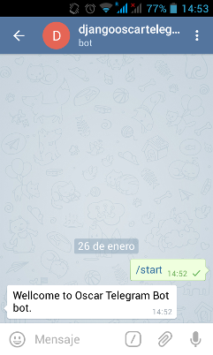
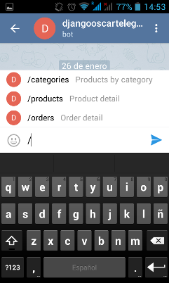
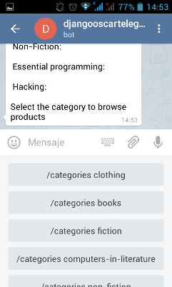
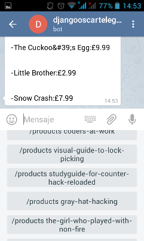
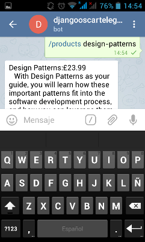
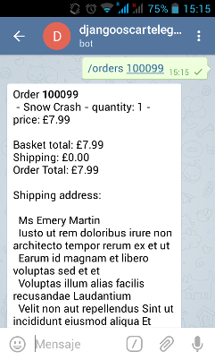

========
Usage
========

Configure in settings::

	TELEGRAM_BOT_COMMANDS_CONF = "oscar_telegrambot.commands"
	
As other django-telegram-bot app set your bot token::

	TELEGRAM_BOT_TOKEN = os.environ.get('TELEGRAM_BOT_TOKEN', None)
	
Add url to have webhook::

	url(r'^telegrambot/', include('telegrambot.urls')),
	
To set the webhook for telegram you need 'django.contrib.sites' installed, SITE_ID configured in settings and
with it correct value in the DB.

You can take a look to a demo repo using the sandbox in https://github.com/jlmadurga/django-oscar-telegram-bot-demo.
This demo is already installed in http://django-oscar-telegram-bot-demo.herokuapp.com/en-gb/ and you can test the
bot https://telegram.me/djangooscartelegrambotdemo_bot

You can override templates of the messages. Just add new templates for texts and keyboards in 
your_template_dir/telegrambot/messages/

Screenshots from demo
--------------------

Wellcome:

List of commands:

List of categories and keyboard to select the category:

Products of a category. Select the product in keyboard:

Product detail:

Order detail providing order number:

